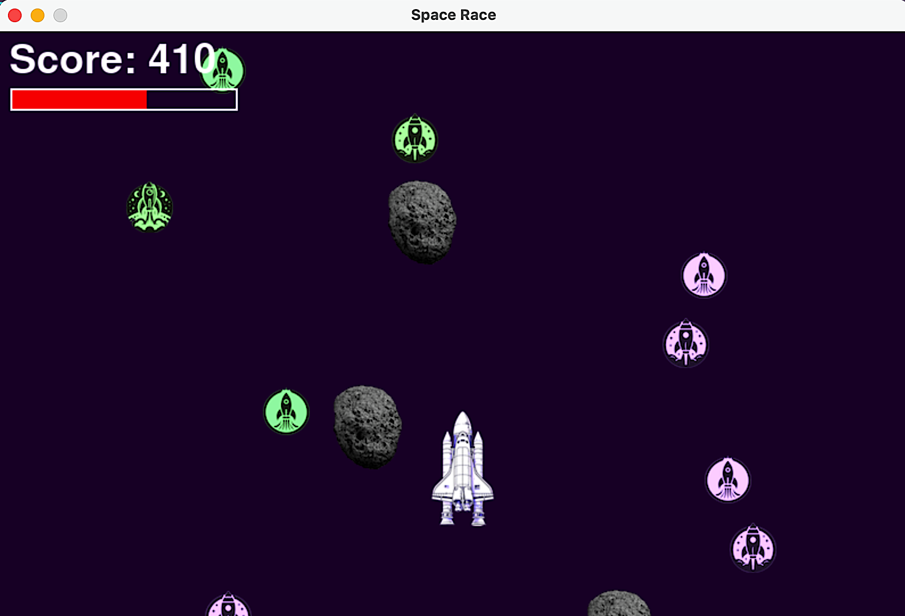

# Space Race


Space Race is an arcade-style game built with Python and Pygame-CE. You play a spaceship pilot tasked with navigating through an asteroid field. The goal is to avoid collisions with asteroids while collecting power-ups and reaching the highest score possible. The game features a visually appealing interface, background music, sound effects for asteroid collisions and power-ups, and smooth controls, making it an engaging experience for players of all ages.

☝️ ☝️ ️This project was developed as educational material for game development, inspired by classic arcade games but with a modern twist, including audio feedback and dynamic visuals.

## Requirements and Installation

1. To run this project, you need the following software:

    ```bash
     ➡️ Python 3.x
     ➡️ Pygame-CE library
    ```

2. Get the code and navigate to the project directory:

   ```bash
   git clone https://github.com/tpreisig/space-race
   cd space-race
   ```

3. Create a virtual environment (optional but recommended):

   ```bash
   python3 -m venv venv
   source venv/bin/activate  # On Windows use `venv\Scripts\activate`
   ```

4. Install Pygame-CE:

   ```bash
   python3 -m pip install pygame-ce
   ```

## Code Snippets

➡️ Framerate-indenpendent movement

```bash
dt = clock.tick(config.FPS) / 1000
self.rect.x += dx * speed * dt
```

➡️ Collison Detection

```bash
if pygame.sprite.spritecollide(player, collectibles_group, True):
    score += 10
    if score_up:
        score_up.play()

if pygame.sprite.spritecollide(player, asteroid_group, True):
    player.health -= 20
    if hit_sound:
        hit_sound.play()
```

## License

This project is licensed under the MIT License - see the [LICENSE](LICENSE) file for details.

## Screenshots



## Contact

Maintained by tpreisg - feel free to reach out!
